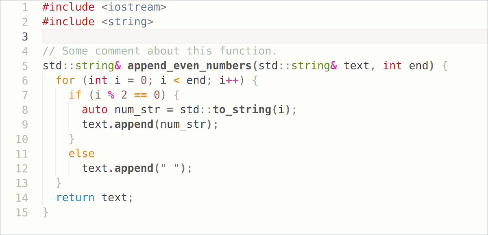
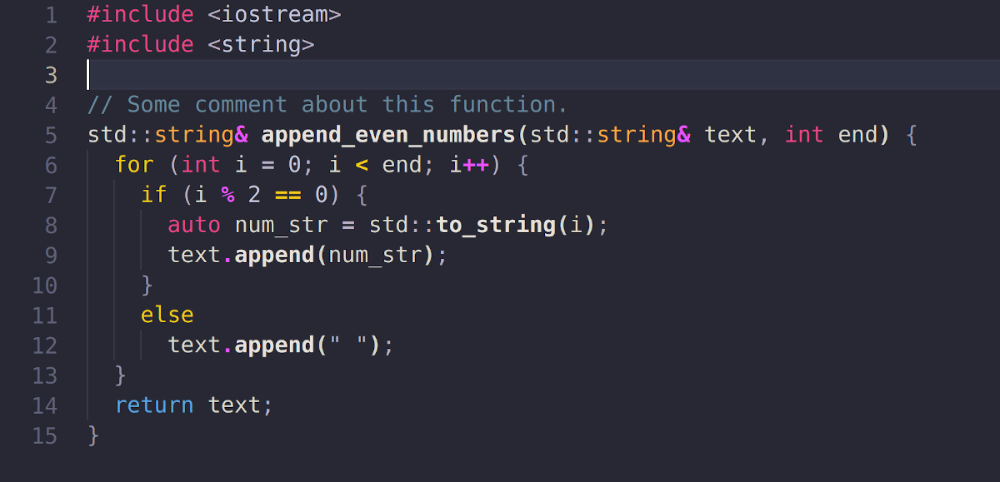
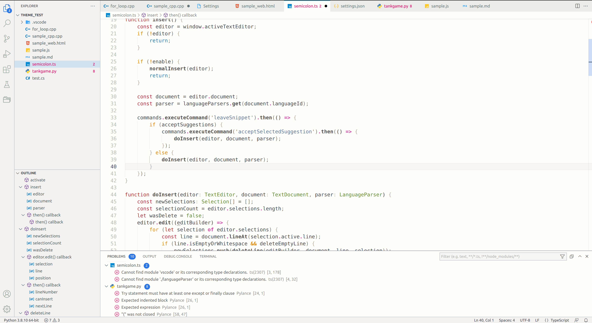
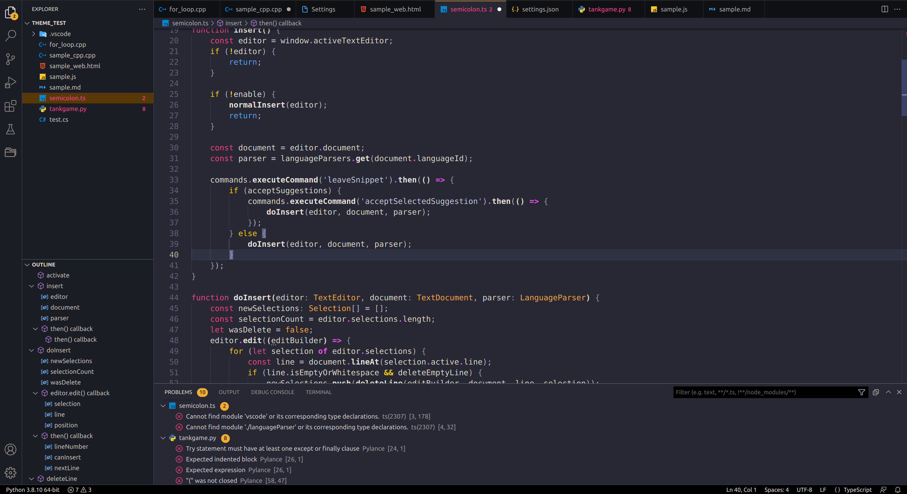

# Cereal Theme for VS Code

This extension provides both light and dark themes for VS Code. The themes are designed to improve user's focus by applying colors to essential tokens only - such as heading, operator, or control flows in programming.

## Light Theme

## Dark Theme

## Supported Languages

This extension supports the following languages:
- C/C++
- Javascript/Typescript
- JSON
- Python
- Markdown
